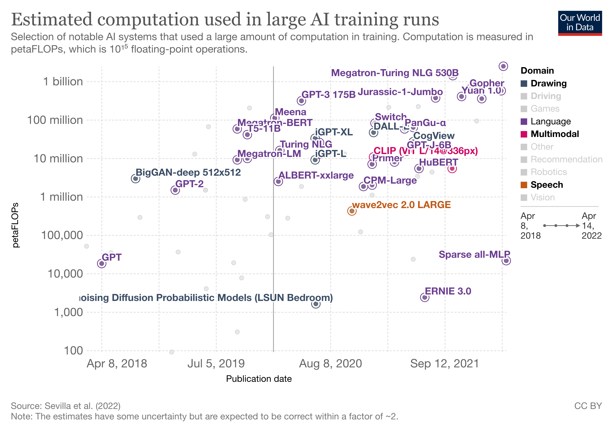

<!-- omit in toc -->
# awesome-big-models [](https://awesome.re)

[](https://opensource.org/licenses/MIT)

A collection of AWESOME things about BIG AI models.

There is a trend of training large-scale deep learning models (w.r.t. params, dataset, FLOPs) led by big companies. These models achieve the SoTA perfermance at a high price, with bags of training tricks and distributed training systems. Keeping an eye on this trend informs us of the current boundaries of AI models. [[Intro in Chinese](https://zhuanlan.zhihu.com/p/529863941)]

<!-- omit in toc -->
## Contents
  
- [Survey](#survey)
- [Multi-modality Models](#multi-modality-models)
- [Models](#models)
- [Recommendation Training Framework](#recommendation-training-framework)
- [Distributed Training Framework](#distributed-training-framework)
- [Keys Explanations](#keys-explanations)

## Survey

- [Compute Trends Across Three Eras of Machine Learning](https://arxiv.org/abs/2202.05924) [[chart](https://ourworldindata.org/grapher/ai-training-computation)]
- [A Roadmap to Big Model](https://arxiv.org/abs/2203.14101)
- [On the Opportunities and Risk of Foundation Models](https://arxiv.org/abs/2108.07258)
- [Pre-Trained Models: Past, Present and Future](https://arxiv.org/abs/2106.07139)

<p align="center">
    
</p >

## Multi-modality Models

- **Imagen** [[Google]](https://imagen.research.google/) May 2022  
    Photorealistic Text-to-Image Diffusion Models with Deep Language Understanding [[Preprint]](https://arxiv.org/abs/2205.11487)

    ```yaml
    Understand: Language
    Generation: Image
    Text Encoder: T5
    Image Decoder: Diffusion, Upsampler
    ```

- **DALL·E 2** [[OpenAI]](https://openai.com/dall-e-2/) Apr 2022  
    Hierarchical Text-Conditional Image Generation with CLIP Latents [[Preprint]](https://cdn.openai.com/papers/dall-e-2.pdf)

    ```yaml
    Understand: Language
    Generation: Image
    Text Encoder: GPT2 (CLIP)
    Image Encoder: ViT (CLIP)
    Image Decoder: Diffusion, Upsampler
    ```

- **BaGuaLu** [[BAAI, Alibaba]]() Apr 2022  
    BaGuaLu: targeting brain scale pretrained models with over 37 million cores [[PPoPP'22]](https://keg.cs.tsinghua.edu.cn/jietang/publications/PPOPP22-Ma%20et%20al.-BaGuaLu%20Targeting%20Brain%20Scale%20Pretrained%20Models%20w.pdf)

    ```yaml
    Understand: Image, Language
    Params: 174T
    Architecture: M6
    ```

- **NUWA** [[Microsoft]]() Nov 2021 [</>](https://github.com/microsoft/NUWA)  
    NÜWA: Visual Synthesis Pre-training for Neural visUal World creAtion [[Preprint]](https://arxiv.org/abs/2111.12417)

    ```yaml
    Understand: Image, Language
    Generatioon: Image, Video
    Params: 870M
    ```

- **Zidongtaichu** [[CASIA]](http://www.ia.cas.cn/xwzx/kydt/202109/t20210927_6215538.html) Sept 2021

    ```yaml
    Understand: Image, Video, Language, Speech
    Params: 100B
    ```

- **CogView** [[BAAI, Alibaba]](https://wudao.aminer.cn/CogView/index.html) May 2021 [</>](https://github.com/THUDM/CogView)  
    CogView: Mastering Text-to-Image Generation via Transformers [[NeurIPS'21]](https://arxiv.org/abs/2105.13290)

    ```yaml
    Understand: Language
    Generation: Image
    Params: 4B
    Training Data: (30M text-image pairs)
    Training petaFLOPs: 27M
    Image Encoder: VAE
    Text Encoder & Image Decoder: GPT2
    ```

- **M6** [[Alibaba]](https://m6.aliyun.com/#/) Mar 2021  
    M6: A Chinese Multimodal Pretrainer [[Preprint]](https://arxiv.org/abs/2103.00823)

    ```yaml
    Understand: Image, Language
    Params: 10T
    Training Data: 300G Texts + 2TB Images
    Training petaFLOPs: 5.5M
    Fusion: Single-stream
    Objective: MLM, IC
    ```

- **DALL·E** [[OpenAI]](https://openai.com/blog/dall-e/) Feb 2021  
    Zero-Shot Text-to-Image Generation [[ICML'21]](https://arxiv.org/abs/2102.12092)

    ```yaml
    Understand: Language
    Generation: Image
    Params: 12B
    Training Data: (250M text-images pairs)
    Training petaFLOPs: 47M
    Image Encoder: dVAE
    Text Encoder & Image Decoder: GPT2
    ```

- **CLIP** [[OpenAI]](https://openai.com/blog/clip/) Jan 2021  
    Learning Transferable Visual Models From Natural Language Supervision [[ICML'22]](https://arxiv.org/abs/2103.00020)

    ```yaml
    Understand: Image, Language
    Training Data: 400M text-image pairs
    Training petaFLOPs: 11M
    Image Encoder: ViT
    Text Encoder: GPT-2
    Fusion: Dual Encoder
    Objective: CMCL
    ```

- **WuDao-WenLan** [[BAAI]]() Mar 2021  

    ```yaml
    Understand: Image, Language
    Params: 1B
    Fusion: Dual-stream
    Objective: MLM, VLM
    ```

## Models

- **UL2** [[Google]]() May 2022  
    Unifying Language Learning Paradigms [[Preprint]](https://arxiv.org/abs/2205.05131)

    ```yaml
    Field: Language
    Params: 20B
    Training Data: 800GB
    Achitecture: En-De
    ```

- **Gato** [[DeepMind]](https://www.deepmind.com/publications/a-generalist-agent) May 2022  
    A Generalist Agent [[Preprint]](https://arxiv.org/abs/2205.06175)

    ```yaml
    Field: Reinforcement Learning
    Params: 1.2B
    Training Data: (604 Tasks)
    Objective: Supervised
    ```

- **PaLM** [[Google]](https://ai.googleblog.com/2022/04/pathways-language-model-palm-scaling-to.html) Apr 2022  
    PaLM: Scaling Language Modeling with Pathways [[Preprint]](https://arxiv.org/abs/2204.02311)

    ```yaml
    Field: Language
    Params: 550B
    Training Data: 3TB (780B tokens)
    Training Cost: $10M
    Training petaFLOPs: 2.5B
    Architecture: De
    ```

- **OPT** [[Meta]](https://ai.facebook.com/blog/democratizing-access-to-large-scale-language-models-with-opt-175b/) May 2022 [</>](https://github.com/facebookresearch/metaseq)  
    OPT: Open Pre-trained Transformer Language Models [[Preprint]](https://arxiv.org/abs/2205.01068)

    ```yaml
    Field: Language
    Params: 175B
    Training Data: 800GB
    Architecutre: De
    ```

- **GPT-NeoX** [[EleutherAI]](https://blog.eleuther.ai/announcing-20b/) Apr 2022 [</>](https://github.com/EleutherAI/gpt-neox)  
    GPT-NeoX-20B: An Open-Source Autoregressive Language Model [[Preprint]](https://arxiv.org/abs/2204.06745)

    ```yaml
    Field: Language
    Params: 20B
    Training petaFLOPs: 93B
    Architecture: De
    ```

- **Chinchilla** [[DeepMind]](https://www.deepmind.com/publications/an-empirical-analysis-of-compute-optimal-large-language-model-training) Mar 2022  
    Training Compute-Optimal Large Language Models [[Preprint]](https://arxiv.org/abs/2203.15556)

    ```yaml
    Field: Language
    Params: 70B
    Training Data: 5.2TB
    Training petaFLOPs: 580M
    Architecture: De
    ```

- **EVA 2.0** [[BAAI]](https://wudaoai.cn/model/detail/EVA) Mar 2022  
    EVA2.0: Investigating Open-Domain Chinese Dialogue Systems with Large-Scale Pre-Training [[Preprint]](https://arxiv.org/abs/2203.09313)

    ```yaml
    Field: Language (Dialogue)
    Params: 2.8B
    Training Data: 180G (1.4B samples, Chinese)
    ```

- **AlphaCode** [[DeepMind]](https://www.deepmind.com/blog/competitive-programming-with-alphacode) Mar 2022  
    Competition-Level Code Generation with AlphaCode [[Preprint]](https://arxiv.org/abs/2203.07814)

    ```yaml
    Field: Code Generation
    Params: 41B
    Training Data: (967B tokens)
    Architecture: De
    ```

- **SEER** [[Meta]]() Feb 2022 [</>](https://github.com/facebookresearch/vissl)  
    Vision Models Are More Robust And Fair When Pretrained On Uncurated Images Without Supervision [[Preprint]](https://arxiv.org/abs/2202.08360v2)

    ```yaml
    Field: Vision
    Params: 10B
    Training Data: (1B images)
    Architecture: Convolution
    Objective: SwAV
    ```

- **ST-MoE** [[Google]]() Feb 2022  
    ST-MoE: Designing Stable and Transferable Sparse Expert Models [[Preprint]](https://arxiv.org/abs/2202.08906)

    ```yaml
    Field: Language
    Params: 296B
    Architecture: En-De, MoE
    ```

- **LaMDA** [[Google]](https://arxiv.org/abs/2201.08239) Jan 2022  
    LaMDA: Language Models for Dialog Applications [[Preprint]](https://arxiv.org/abs/2201.08239)

    ```yaml
    Field: Language (Dialogue)
    Params: 137B
    Training Data: (1.56T words)
    Training petaFLOPs: 360M
    Architecture: De
    ```

- **ERNIE-ViLG** [[Baidu]](https://wenxin.baidu.com/wenxin/ernie-vilg) Dec 2022  
    ERNIE-ViLG: Unified Generative Pre-training for Bidirectional Vision-Language Generation [[Preprint]](https://arxiv.org/abs/2112.15283)

    ```yaml
    Field: Image Generation (text to image)
    Params: 10B
    Training Data: (145M text-image pairs)
    Architecture: Transformer, dVAE + De
    ```

- **GLaM** [[Google]](https://ai.googleblog.com/2021/12/more-efficient-in-context-learning-with.html) Dec 2021  
    GLaM: Efficient Scaling of Language Models with Mixture-of-Experts [[Preprint]](https://arxiv.org/abs/2112.06905)

    ```yaml
    Field: Language
    Params: 1.2T
    Architecture: De, MoE
    ```

- **Gopher** [[DeepMind]](https://www.deepmind.com/blog/language-modelling-at-scale-gopher-ethical-considerations-and-retrieval) Dec 2021  
    Scaling Language Models: Methods, Analysis & Insights from Training Gopher [[Preprint]](https://arxiv.org/abs/2112.11446)

    ```yaml
    Field: Language
    Params: 280B
    Training Data: 1.3TB (300B tokens)
    Training petaFLOPs: 630M
    Architecture: De
    ```

- **SwinV2-G** [[Google]]() Nov 2021 [</>](https://github.com/microsoft/Swin-Transformer)  
    Swin Transformer V2: Scaling Up Capacity and Resolution [[CVPR'22]](https://arxiv.org/abs/2111.09883v2)

    ```yaml
    Field: Vision
    Params: 3B
    Training Data: 70M
    Architecture: Transformer
    Objective: Supervised
    ```

- **Yuan 1.0** [[inspur]](https://air.inspur.com/home) Oct 2021  
    Yuan 1.0: Large-Scale Pre-trained Language Model in Zero-Shot and Few-Shot Learning [[Preprint]](https://arxiv.org/abs/2110.04725)

    ```yaml
    Field: Language
    Params: 245B
    Training Data: 5TB (180B tokens, Chinese)
    Training petaFLOPs: 410M
    Architecture: De, MoE
    ```

- **MT-NLG** [[Microsoft, Nvidia]](https://www.microsoft.com/en-us/research/blog/using-deepspeed-and-megatron-to-train-megatron-turing-nlg-530b-the-worlds-largest-and-most-powerful-generative-language-model/) Oct 2021  
    Using DeepSpeed and Megatron to Train Megatron-Turing NLG 530B, A Large-Scale Generative Language Model [[Preprint]](https://arxiv.org/abs/2201.11990)

    ```yaml
    Field: Language
    Params: 530B
    Training Data: (339B tokens)
    Training petaFLOPs: 1.4B
    Architecture: De
    ```

- **Plato-XL** [[Baidu]](http://research.baidu.com/Blog/index-view?id=163) Sept 2021  
    PLATO-XL: Exploring the Large-scale Pre-training of Dialogue Generation [[Preprint]](https://arxiv.org/abs/2109.09519)

    ```yaml
    Field: Language (Dialogue)
    Params: 11B
    Training Data: (1.2B samples)
    ```

- **Jurassic-1** [[AI21 Labs]](https://www.zdnet.com/article/watch-out-gpt-3-here-comes-ai21s-jurassic-language-model/) Aug 2021  
    Jurassic-1: Technical Details and Evaluation [[Preprint]](https://uploads-ssl.webflow.com/60fd4503684b466578c0d307/61138924626a6981ee09caf6_jurassic_tech_paper.pdf)

    ```yaml
    Field: Language
    Params: 178B
    Training petaFLOPs: 370M
    Architecture: De
    ```

- **Codex** [[DeepMind]](https://openai.com/blog/openai-codex/) July 2021  
    Evaluating Large Language Models Trained on Code [[Preprint]](https://arxiv.org/abs/2107.03374)

    ```yaml
    Field: Code Generation
    Params: 12B
    Training Data: 159GB
    Architecture: De
    ```

- **ERNIE 3.0** [[Baidu]](https://wenxin.baidu.com/wenxin/ernie) July 2021  
    ERNIE 3.0: Large-scale Knowledge Enhanced Pre-training for Language Understanding and Generation [[Preprint]](https://arxiv.org/abs/2107.02137)

    ```yaml
    Field: Language
    Params: 10B
    Training Data: 4TB (375B tokens, with knowledge graph)
    Architecture: En
    Objective: MLM
    ```

- **AlphaFold 2** [[DeepMind]](https://www.deepmind.com/research/highlighted-research/alphafold) July 2021 [</>](https://github.com/deepmind/alphafold)  
    Highly accurate protein structure prediction with AlphaFold [[Nature]](https://www.nature.com/articles/s41586-021-03819-2)

    ```yaml
    Field: Biology
    Params: 21B
    Training petaFLOPs: 100k
    ```

- **ViT-G/14** [[Google]]() June 2021  
    Scaling Vision Transformers [[Preprint]](https://arxiv.org/abs/2106.04560)

    ```yaml
    Field: Vision
    Params: 1.8B
    Training Data: (300M images)
    Training petaFLOPs: 3.4M
    Architecture: Transformer
    Objective: Supervised
    ```

- **CoAtNet** [[Google]](https://ai.googleblog.com/2021/09/toward-fast-and-accurate-neural.html) June 2021 [</>](https://github.com/chinhsuanwu/coatnet-pytorch)  
    CoAtNet: Marrying Convolution and Attention for All Data Sizes [[NeurIPS'21]](https://arxiv.org/abs/2106.04803)

    ```yaml
    Field: Vision
    Params: 2.4B
    Training Data: (300M images)
    Architecture: Transformer, Convolution
    Objective: Supervised
    ```

- **V-MoE** [[Google]](https://ai.googleblog.com/2022/01/scaling-vision-with-sparse-mixture-of.html) June 2021  
    Scaling Vision with Sparse Mixture of Experts [[NeurIPS'21]](https://proceedings.neurips.cc//paper/2021/file/48237d9f2dea8c74c2a72126cf63d933-Paper.pdf)

    ```yaml
    Field: Vision
    Params: 15B
    Training Data: (300M images)
    Training Time: 16.8k TPUv3 days
    Training petaFLOPs: 33.9M
    Architecture: Transformer, MoE
    Objective: Supervised
    ```

- **CPM-2** [[BAAI]]() June 2021 [</>](https://github.com/TsinghuaAI/CPM)  
    CPM-2: Large-scale Cost-effective Pre-trained Language Models [[Preprint]](https://arxiv.org/abs/2106.10715)

    ```yaml
    Field: Language
    Params: 198B
    Training Data: 2.6TB (Chinese 2.3TB, English 300GB)
    Architecture: En-De
    Objective: MLM
    ```

- **HuBERT** [[Meta]](https://ai.facebook.com/blog/hubert-self-supervised-representation-learning-for-speech-recognition-generation-and-compression/) June 2021 [</>](https://github.com/facebookresearch/fairseq/tree/main/examples/hubert)  
    HuBERT: Self-Supervised Speech Representation Learning by Masked Prediction of Hidden Units [[Preprint]](https://arxiv.org/abs/2106.07447)

    ```yaml
    Field: Speech
    Params: 1B
    Training Data: (60k hours)
    Objective: MLM
    ```

- **HyperClova** [[Naver]](https://www.navercorp.com/promotion/pressReleasesView/30546) May 2021  
    What Changes Can Large-scale Language Models Bring? Intensive Study on HyperCLOVA: Billions-scale Korean Generative Pretrained Transformers [[Preprint]](https://arxiv.org/abs/2109.04650v1)

    ```yaml
    Field: Language
    Params: 82B
    Training Data: (562B tokens, Korean)
    Training petaFLOPs: 63B
    Architecture: De
    ```

- **ByT5** [[Google]]() May 2021 [</>](https://github.com/google-research/byt5)  
    ByT5: Towards a token-free future with pre-trained byte-to-byte models [[TACL'22]](https://arxiv.org/abs/2105.13626)

    ```yaml
    Field: Language
    Params: 13B
    Training Data: (101 languages)
    Architecture: En-De
    ```

- **PanGu-α** [[Huawei]]() Apr 2021  
    PanGu-α: Large-scale Autoregressive Pretrained Chinese Language Models with Auto-parallel Computation [[Preprint]](https://arxiv.org/abs/2104.12369)

    ```yaml
    Field: Language
    Params: 200B
    Training Data: 1.1TB (Chinese)
    Training petaFLOPs: 58M
    Architecture: De
    ```

- **mT5** [[Google]]() Mar 2021 [</>](https://github.com/google-research/multilingual-t5)  
    mT5: A massively multilingual pre-trained text-to-text transformer [[Preprint]](https://arxiv.org/abs/2010.11934)

    ```yaml
    Field: Language
    Params: 13B
    Training Data: (101 languages)
    Architecture: En-De
    ```

- **WuDao-WenHui** [[BAAI]]() Mar 2021  

    ```yaml
    Field: Language
    Params: 11.3B
    ```

- **Switch Transformer**  [[Google]]() Jan 2021 [</>](https://github.com/google-research/t5x)  
    Switch Transformers: Scaling to Trillion Parameter Models with Simple and Efficient Sparsity [[Preprint]](https://arxiv.org/abs/2101.03961)

    ```yaml
    Field: Language
    Params: 1.6T
    Training Data: 750GB
    Training petaFLOPs: 82M
    Architecture: En-De, MoE
    Objective: MLM
    ```

- **CPM** [[BAAI]]() Dec 2020 [</>](https://github.com/TsinghuaAI/CPM)  
    CPM: A Large-scale Generative Chinese Pre-trained Language Model [[Preprint]](https://arxiv.org/abs/2012.00413)

    ```yaml
    Field: Language
    Params: 2.6B
    Training Data: 100G (Chinese)
    Training petaFLOPs: 1.8M
    Architecture: De
    Objective: LTR
    ```

- **ViT-H/14** [[Google]](https://ai.googleblog.com/2020/12/transformers-for-image-recognition-at.html) Oct 2020 [</>](https://github.com/google-research/vision_transformer)  
    An Image is Worth 16x16 Words: Transformers for Image Recognition at Scale [[ICLR'20]](https://arxiv.org/abs/2010.11929)

    ```yaml
    Field: Vision
    Params: 632M
    Training Data: (300M images)
    Training petaFLOPs: 13M
    Architecture: Transformer
    Objective: Supervised
    ```

- **wav2vec 2.0** [[Meta]](https://arxiv.org/abs/2006.11477) Oct 2020 [</>](https://github.com/facebookresearch/fairseq/tree/main/examples/wav2vec)  
    wav2vec 2.0: A Framework for Self-Supervised Learning of Speech Representations [[NeurIPS'20]](https://arxiv.org/abs/2006.11477)

    ```yaml
    Field: Speech
    Params: 317M
    Training Data: (50k hours)
    Training petaFLOPs: 430M
    Objective: MLM
    ```

- **iGPT-XL** [[OpenAI]](https://openai.com/blog/image-gpt/) June 2020 [</>](https://github.com/openai/image-gpt)  
    Generative Pretraining From Pixels [[ICML'20]](https://proceedings.mlr.press/v119/chen20s.html)

    ```yaml
    Field: Image Generation
    Params: 6.8B
    Training Data: (1M images)
    Training petaFLOPs: 33M
    Architecture: Transformer, De
    ```

- **GPT-3** [[OpenAI]](https://openai.com/api/) May 2020  
    Language Models are Few-Shot Learners [[NeurIPS'20]](https://papers.nips.cc/paper/2020/file/1457c0d6bfcb4967418bfb8ac142f64a-Paper.pdf)  

    ```yaml
    Field: Language  
    Params: 175B  
    Training Data: 45TB (680B Tokens)
    Training Time: 95 A100 GPU years (355 V100 GPU years)
    Training Cost: $4.6M
    Training petaFLOPs: 310M
    Architecture: De
    Obective: LTR
    ```

- **Blender** [[Meta]](https://ai.facebook.com/blog/blender-bot-2-an-open-source-chatbot-that-builds-long-term-memory-and-searches-the-internet/) Apr 2020 [</>](https://huggingface.co/facebook/blenderbot-90M?text=Hey+my+name+is+Thomas%21+How+are+you%3F)  
    Recipes for building an open-domain chatbot [[Preprint]](https://arxiv.org/abs/2004.13637)

    ```yaml
    Field: Language (Dialogue)
    Params: 9.4B
    ```

- **T-NLG** [[Microsoft]](https://www.microsoft.com/en-us/research/blog/turing-nlg-a-17-billion-parameter-language-model-by-microsoft/) Feb 2020

    ```yaml
    Field: Language
    Params: 17B
    Training petaFLOPs: 16M
    Architecture: De
    Obective: LTR
    ```

- **Meena** [[Google]](https://ai.googleblog.com/2020/01/towards-conversational-agent-that-can.html) Jan 2020  
    Towards a Human-like Open-Domain Chatbot [[Preprint]](https://arxiv.org/abs/2001.09977)

    ```yaml
    Field: Language (Dialogue)
    Params: 2.6B
    Training Data: 341GB (40B words)
    Training petaFLOPs: 110M
    ```

- **DialoGPT** [[Microsoft]](https://www.microsoft.com/en-us/research/project/large-scale-pretraining-for-response-generation/) Nov 2019 [</>](https://github.com/microsoft/DialoGPT)  
    DialoGPT: Large-Scale Generative Pre-training for Conversational Response Generation [[ACL'20]](https://arxiv.org/abs/1911.00536)

    ```yaml
    Field: Language (Dialogue)
    Params: 762M
    Training Data: (147M conversation)
    Architecture: De
    ```

- **T5** [[Google]](https://ai.googleblog.com/2020/02/exploring-transfer-learning-with-t5.html) Oct 2019 [</>](https://github.com/google-research/text-to-text-transfer-transformer)  
    Exploring the Limits of Transfer Learning with a Unified Text-to-Text Transformer [[JMLR'19]](https://arxiv.org/abs/1910.10683)

    ```yaml
    Field: Language
    Params: 11B
    Training Data: 800GB
    Training Cost: $1.5M
    Training petaFLOPs: 41M
    Architecture: En-De
    Obective: MLM
    ```

- **Megatron-LM** [[Nvidia]]() Sept 2019 [</>](https://github.com/NVIDIA/Megatron-LM)  
    Megatron-LM: Training Multi-Billion Parameter Language Models Using Model Parallelism [[Preprint]](https://arxiv.org/abs/1909.08053)

    ```yaml
    Field: Language
    Params: 8.3B
    Training Data: 174 GB
    Training petaFLOPs: 9.1M
    Architecture: De
    Obective: LTR
    ```

- **Megatron-BERT** [[Nvidia]]() Sept 2019 [</>](https://github.com/NVIDIA/Megatron-LM)  
    Megatron-LM: Training Multi-Billion Parameter Language Models Using Model Parallelism [[Preprint]](https://arxiv.org/abs/1909.08053)

    ```yaml
    Field: Language
    Params: 3.9B
    Training Data: 174 GB
    Training petaFLOPs: 57M
    Architecture: En
    Obective: MLM
    ```

- **RoBERTa** [[Meta]](https://ai.facebook.com/blog/roberta-an-optimized-method-for-pretraining-self-supervised-nlp-systems/) July 2019 [</>](https://github.com/facebookresearch/fairseq)  
    RoBERTa: A Robustly Optimized BERT Pretraining Approach [[Preprint]](https://arxiv.org/abs/1907.11692)  

    ```yaml
    Field: Language
    Params: 354M
    Training Data: 160GB
    Training Time: 1024 V100 GPU days
    Architecture: En
    Objective: MLM
    ```

- **XLNet** [[Google]]() June 2019 [</>](https://github.com/zihangdai/xlnet)  
    XLNet: Generalized Autoregressive Pretraining for Language Understanding [[NeurIPS'19]](https://papers.nips.cc/paper/2019/hash/dc6a7e655d7e5840e66733e9ee67cc69-Abstract.html)

    ```yaml
    Field: Language
    Params: 340M
    Training Data: 113GB (33B words)
    Training Time: 1280 TPUv3 days
    Training Cost: $245k
    Architecture: En
    Objective: PLM
    ```

- **GPT-2** [[OpenAI]](https://openai.com/blog/better-language-models/) Feb 2019 [</>](https://github.com/openai/gpt-2)  
    Language Models are Unsupervised Multitask Learners [[Preprint]](https://cdn.openai.com/better-language-models/language_models_are_unsupervised_multitask_learners.pdf)

    ```yaml
    Field: Language  
    Params: 1.5B
    Training Data: 40GB (8M web pages)
    Training Cost: $43k
    Training petaFLOPs: 1.5M
    Architecture: De
    Objective: LTR
    ```

- **BERT** [[Google]]() Oct 2018 [</>](https://github.com/google-research/bert)  
    BERT: Pre-training of Deep Bidirectional Transformers for Language Understanding [[NAACL'18]](https://arxiv.org/abs/1810.04805)

    ```yaml
    Field: Language
    Params: 330M
    Training Data: 16GB (3.3B words)
    Training Time: 64 TPUv2 days (280 V100 GPU days)
    Training Cost: $7k
    Training petaFLOPs: 290k
    Architecture: En
    Objective: MLM, NSP
    ```

- **BigGAN-deep** [[DeepMind]]() Sept 2018 [</>](https://github.com/ajbrock/BigGAN-PyTorch)  
    Large Scale GAN Training for High Fidelity Natural Image Synthesis [[ICLR'19]](https://arxiv.org/abs/1809.11096)

    ```yaml
    Field: Image Generation
    Params: 158M
    Training Data: (300M images)
    Training petaFLOPs: 3M
    Architecture: Convolution, GAN
    Resolution: 512x512
    ```

- **GPT** [[OpenAI]](https://openai.com/blog/language-unsupervised/) June 2018  
    Improving Language Understanding by Generative Pre-Training [[Preprint]](https://s3-us-west-2.amazonaws.com/openai-assets/research-covers/language-unsupervised/language_understanding_paper.pdf)

    ```yaml
    Field: Language  
    Params: 117M 
    Training Data: 1GB (7k books)
    Training petaFLOPs: 18k
    Architecture: De
    Objective: LTR
    ```

## Recommendation Training Framework

- **HET** [[Tencent]]() Dec 2021  
    HET: Scaling out Huge Embedding Model Training via Cache-enabled Distributed Framework [[VLDB'22]](https://arxiv.org/abs/2112.07221)
- **Persia** [[Kuaishou]]() Nov 2021  
    Persia: An Open, Hybrid System Scaling Deep Learning-based Recommenders up to 100 Trillion Parameters [[Preprint]](https://arxiv.org/abs/2111.05897)  
    Embeddings Params: 100T
- **ZionEX** [[Facebook]]() Apr 2021  
    Software-Hardware Co-design for Fast and Scalable Training of Deep Learning Recommendation Models [[ISCA'21]](https://arxiv.org/abs/2104.05158)  
    Embeddings Params: 10T
- **ScaleFreeCTR** [[Huawei]]() Apr 2021  
    ScaleFreeCTR: MixCache-based Distributed Training System for CTR Models with Huge Embedding Table [[SIGIR'21]](https://arxiv.org/abs/2104.08542)
- **Kraken** [[Kuaishou]]() Nov 2020  
    Kraken: Memory-Efficient Continual Learning for Large-Scale Real-Time Recommendations [[SC'20]](http://storage.cs.tsinghua.edu.cn/papers/sc20-kraken.pdf/)
- **TensorNet** [[Qihoo360]]() Sept 2020 [</>](https://github.com/Qihoo360/tensornet)
- **HierPS** [[Baidu]]() Mar 2020  
    Distributed Hierarchical GPU Parameter Server for Massive Scale Deep Learning Ads Systems [[MLSys'20]](https://arxiv.org/abs/2003.05622)
- **AIBox** [[Baidu]]() Oct 2019  
    AIBox: CTR Prediction Model Training on a Single Node [[CIKM'20]](https://dl.acm.org/doi/pdf/10.1145/3357384.3358045)  
    Embeddings Params: 0.1T
- **XDL** [[Alibaba]]() Aug 2019  
    XDL: an industrial deep learning framework for high-dimensional sparse data [[DLP-KDD'21]](https://dlp-kdd.github.io/dlp-kdd2019/assets/pdf/a6-jiang.pdf)  
    Embeddings Params: 0.01T

## Distributed Training Framework

> Deep Learning frameworks supportting distributed training are marked with *.

- **Pathways** [[Google]](https://blog.google/technology/ai/introducing-pathways-next-generation-ai-architecture/) Mar 2021  
    Pathways: Asynchronous Distributed Dataflow for ML [[Preprint]](https://arxiv.org/abs/2203.12533)
- **Colossal-AI** [[HPC-AI TECH]](https://colossalai.org/) Nov 2021 [</>](https://github.com/hpcaitech/ColossalAI)  
    Colossal-AI: A Unified Deep Learning System For Large-Scale Parallel Training [[Preprint]](https://arxiv.org/abs/2110.14883)
- **OneFlow*** [[OneFlow]](https://docs.oneflow.org/master/index.html) July 2020 [</>](https://github.com/OneFlow-Inc/oneflow)  
    OneFlow: Redesign the Distributed Deep Learning Framework from Scratch [[Preprint]](https://arxiv.org/abs/2110.15032)
- **GShard** [[Google]](https://arxiv.org/abs/2006.16668) June 2020  
    GShard: Scaling Giant Models with Conditional Computation and Automatic Sharding [[Preprint]](https://arxiv.org/abs/2006.16668)
- **MindSpore*** [[Huawei]](https://e.huawei.com/en/products/cloud-computing-dc/atlas/mindspore) Mar 2020 [</>](https://github.com/mindspore-ai/mindspore)
- **DeepSpeed** [[Microsoft]](https://www.microsoft.com/en-us/research/project/deepspeed/) Oct 2019 [</>](https://github.com/microsoft/DeepSpeed)  
    ZeRO: Memory Optimizations Toward Training Trillion Parameter Models [[SC'20]](https://arxiv.org/abs/1910.02054)
- **Megatron** [[Nivida]]() Sept 2019 [</>](https://github.com/NVIDIA/Megatron-LM)  
    Megatron: Training Multi-Billion Parameter Language Models Using Model Parallelism [[Preprint]](https://arxiv.org/abs/1909.08053)
- **PaddlePaddle** [[Baidu]](https://www.paddlepaddle.org.cn/) Nov 2018 [</>](https://github.com/PaddlePaddle/Paddle)  
    End-to-end Adaptive Distributed Training on PaddlePaddle [[Preprint]](https://arxiv.org/abs/2112.02752)
- **Horovod** [[Uber]](https://horovod.ai/) Feb 2018 [</>](https://github.com/horovod/horovod)  
    Horovod: fast and easy distributed deep learning in TensorFlow [[Preprint]](https://arxiv.org/abs/1802.05799)
- **PyTorch*** [[Meta]](https://pytorch.org/) Sept 2016 [</>](https://github.com/pytorch/pytorch)  
    PyTorch: An Imperative Style, High-Performance Deep Learning Library [[NeurIPS'19]](http://papers.neurips.cc/paper/9015-pytorch-an-imperative-style-high-performance-deep-learning-library.pdf)
- **Tensorflow*** [[Google]](https://www.tensorflow.org/) Nov 2015 [</>](https://github.com/tensorflow/tensorflow)  
    TensorFlow: A system for large-scale machine learning [[OSDI'16]](https://www.usenix.org/system/files/conference/osdi16/osdi16-abadi.pdf)

## Keys Explanations

- Company tags: the related company name. Other institudes may also involve in the job.
- Params: number of parameters of the largest model
- Training data size, training cost and training petaFLOPs may have some uncertainty.
- Training cost
  - TPUv2 hour: $4.5
  - TPUv3 hour: $8
  - V100 GPU hour: $0.55 (2022)
  - A100 GPU hoor: $1.10 (2022)
- Architecture
  - En: Encoder-based Language Model
  - De: Decoder-based Language Model
  - En-De=Encoder-Decoder-based Language Model
  - The above three architectures are powered with transformers.
  - MoE: Mixture of Experts
- Objective (See explanation in section 6–8 of [this paper](https://arxiv.org/pdf/2203.14101v3.pdf))
  - MLM: Masked Language Modeling
  - LTR: Left-To-Right Language Modeling
  - NSP: Next Sentence Prediction
  - PLM: Permuted Language Modeling
  - IC: Image Captioning
  - VLM: Vision Languauge Matching
  - CMCL: Cross-Modal Contrastive Learning
- FLOPs: number of FLOating-Point operations [[explanation]](https://openai.com/blog/ai-and-compute/)
  - 1 petaFLOPs = 1e15 FLOPs
