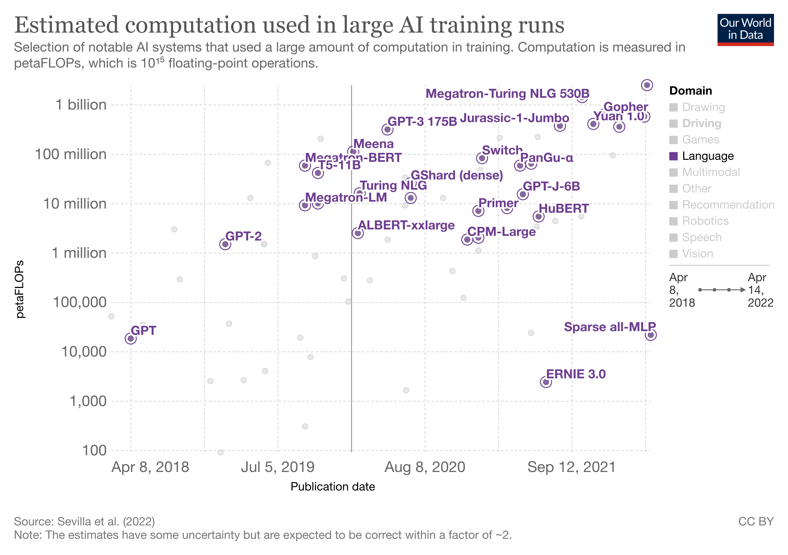

# awesome-big-models [](https://awesome.re)

[](https://opensource.org/licenses/MIT)

A collection of AWESOME things about BIG AI models.

## Survey

- [Compute Trends Across Three Eras of Machine Learning](https://arxiv.org/abs/2202.05924) [[chart](https://ourworldindata.org/grapher/ai-training-computation)]
- [A Roadmap to Big Model](https://arxiv.org/abs/2203.14101)
- [On the Opportunities and Risk of Foundation Models](https://arxiv.org/abs/2108.07258)

<p align="center">
    
</p >

## Models

- **PaLM** [[Google]](https://ai.googleblog.com/2022/04/pathways-language-model-palm-scaling-to.html) Apr 2022  
    PaLM: Scaling Language Modeling with Pathways [[Preprint]](https://arxiv.org/abs/2204.02311)

    ```yaml
    Field: Language
    Params: 550B
    Training Data: (780B tokens)
    Training Cost: ~$10M
    Training petaFLOPs: 2.5B
    ```

- **OPT** [[Meta]](https://ai.facebook.com/blog/democratizing-access-to-large-scale-language-models-with-opt-175b/) May 2022 [</>](https://github.com/facebookresearch/metaseq)  
    OPT: Open Pre-trained Transformer Language Models [[Preprint]](https://arxiv.org/abs/2205.01068)

    ```yaml
    Field: Language
    Params: 175B
    Training Data: 800GB
    Architecutre: De
    Objective: LTR
    ```

- **Chinchilla** [[DeepMind]](https://www.deepmind.com/publications/an-empirical-analysis-of-compute-optimal-large-language-model-training) Mar 2022  
    Training Compute-Optimal Large Language Models [[Preprint]](https://arxiv.org/abs/2203.15556)

    ```yaml
    Field: Language
    Params: 70B
    Training Data: ~5.2TB
    Training petaFLOPs: 580M
    Architecture: De
    ```

- **Gopher** [[DeepMind]](https://www.deepmind.com/blog/language-modelling-at-scale-gopher-ethical-considerations-and-retrieval) Dec 2021  
    Scaling Language Models: Methods, Analysis & Insights from Training Gopher [[Preprint]](https://arxiv.org/abs/2112.11446)

    ```yaml
    Field: Language
    Params: 280B
    Training Data: ~1.3TB (300B tokens)
    Training petaFLOPs: 630M
    Architecture: De
    ```

- **Yuan 1.0** [[inspur]](https://air.inspur.com/home) Oct 2021  
    Yuan 1.0: Large-Scale Pre-trained Language Model in Zero-Shot and Few-Shot Learning [[Preprint]](https://arxiv.org/abs/2110.04725)

    ```yaml
    Field: Language
    Params: 245B
    Training Data: ~5TB (180B tokens, Chinese)
    Training petaFLOPs: 410M
    Architecture: De, MoE
    ```

- **MT-NLG** [[Microsoft, Nvidia]](https://www.microsoft.com/en-us/research/blog/using-deepspeed-and-megatron-to-train-megatron-turing-nlg-530b-the-worlds-largest-and-most-powerful-generative-language-model/) Oct 2021  
    Using DeepSpeed and Megatron to Train Megatron-Turing NLG 530B, A Large-Scale Generative Language Model [[Preprint]](https://arxiv.org/abs/2201.11990)

    ```yaml
    Field: Language
    Params: 530B
    Training Data: (339B tokens)
    Training petaFLOPs: 1.4B
    Architecture: De
    Obective: LTR
    ```

- Jurassic-1

- ERNIE 3.0

- **CPM-2** [[BAAI]]() June 2021 [</>](https://github.com/TsinghuaAI/CPM)  
    CPM-2: Large-scale Cost-effective Pre-trained Language Models [[Preprint]](https://arxiv.org/abs/2106.10715)

    ```yaml
    Field: Language
    Params: 198B
    Training Data: 2.6TB (Chinese 2.3TB, English 300GB)
    Architecture: En-De
    Objective: MLM
    ```

- **PanGu-α** [[Huawei]]() Apr 2021  
    PanGu-α: Large-scale Autoregressive Pretrained Chinese Language Models with Auto-parallel Computation [[Preprint]](https://arxiv.org/abs/2104.12369)

    ```yaml
    Field: Language
    Params: 200B
    Training Data: 1.1TB (Chinese)
    Training petaFLOPs: 58M
    Architecture: De
    Objective: LTR
    ```

- **Switch Transformer**  [[Google]]() Jan 2021  
    Switch Transformers: Scaling to Trillion Parameter Models with Simple and Efficient Sparsity [[Preprint]](https://arxiv.org/abs/2101.03961)

    ```yaml
    Field: Language
    Params: 1.6T
    Training Data: 750GB
    Training petaFLOPs: 82M
    Architecture: En-De
    Objective: MLM
    ```

- **CPM** [[BAAI]]() Dec 2020 [</>](https://github.com/TsinghuaAI/CPM)  
    CPM: A Large-scale Generative Chinese Pre-trained Language Model [[Preprint]](https://arxiv.org/abs/2012.00413)

    ```yaml
    Field: Language (Chinese)
    Params: 2.6B
    Training Data: ~100G (Chinese)
    Training petaFLOPs: 1.8M
    Architecture: De
    Objective: LTR
    ```

- **GPT-3** [[OpenAI]](https://openai.com/api/) May 2020  
    Language Models are Few-Shot Learners [[NeurIPS'20]](https://papers.nips.cc/paper/2020/file/1457c0d6bfcb4967418bfb8ac142f64a-Paper.pdf)  

    ```yaml
    Field: Language  
    Params: 175B  
    Training Data: 45TB (~680B Tokens)
    Training Time: 95 A100 GPU years (355 V100 GPU years)
    Training Cost: $4.6M
    Training petaFLOPs: 310M
    Architecture: De
    Obective: LTR
    ```

- **T-NLG** [[Microsoft]](https://www.microsoft.com/en-us/research/blog/turing-nlg-a-17-billion-parameter-language-model-by-microsoft/) Feb 2020

    ```yaml
    Field: Language
    Params: 17B
    Training petaFLOPs: 16M
    Architecture: De
    Obective: LTR
    ```

- **T5** [[Google]](https://ai.googleblog.com/2020/02/exploring-transfer-learning-with-t5.html) Oct 2019 [</>](https://github.com/google-research/text-to-text-transfer-transformer)  
    Exploring the Limits of Transfer Learning with a Unified Text-to-Text Transformer [JMLR'19](https://arxiv.org/abs/1910.10683)

    ```yaml
    Field: Language
    Params: 11B
    Training Data: ~800 GB
    Training Cost: $1.5M
    Training petaFLOPs: 41M
    Architecture: En-De
    Obective: MLM
    ```

- **Megatron-LM** [[Nvidia]]() Sept 2019 [</>](https://github.com/NVIDIA/Megatron-LM)  
    Megatron-LM: Training Multi-Billion Parameter Language Models Using Model Parallelism [[Preprint]](https://arxiv.org/abs/1909.08053)

    ```yaml
    Field: Language
    Params: 8.3B
    Training Data: 174 GB
    Training petaFLOPs: 57M
    Architecture: En-De; En
    Obective: LTR; MLM
    ```

- **XLNet** [[Google]]() June 2019 [</>](https://github.com/zihangdai/xlnet)  
    XLNet: Generalized Autoregressive Pretraining for Language Understanding [[NeurIPS'19]](https://papers.nips.cc/paper/2019/hash/dc6a7e655d7e5840e66733e9ee67cc69-Abstract.html)

    ```yaml
    Field: Language
    Params: 340M
    Training Data: 113GB (33B words)
    Training Time: 1280 TPUv3 days
    Training Cost: $245k
    Architecture: En
    Objective: PLM
    ```

- **RoBERTa** [[Meta]](https://ai.facebook.com/blog/roberta-an-optimized-method-for-pretraining-self-supervised-nlp-systems/) July 2019 [</>](https://github.com/facebookresearch/fairseq)  
    RoBERTa: A Robustly Optimized BERT Pretraining Approach [[Preprint]](https://arxiv.org/abs/1907.11692)  

    ```yaml
    Field: Language
    Params: 354M
    Training Data: 160GB
    Training Time: 1024 V100 GPU days
    Architecture: En
    Objective: MLM
    ```

- **GPT-2** [[OpenAI]](https://openai.com/blog/better-language-models/) Feb 2019 [</>](https://github.com/openai/gpt-2)  
    Language Models are Unsupervised Multitask Learners [[Preprint]](https://cdn.openai.com/better-language-models/language_models_are_unsupervised_multitask_learners.pdf)

    ```yaml
    Field: Language  
    Params: 1.5B
    Training Data: 40GB (~8M web pages)
    Training Cost: ~$43k
    Training petaFLOPs: 1.5M
    Architecture: De
    Objective: LTR
    ```

- **BERT** [[Google]]() Oct 2018 [</>](https://github.com/google-research/bert)  
    BERT: Pre-training of Deep Bidirectional Transformers for Language Understanding [[NAACL'18]](https://arxiv.org/pdf/1810.04805.pdf)

    ```yaml
    Field: Language
    Params: 330M
    Training Data: 16GB (3.3B words)
    Training Time: 64 TPUv2 days (280 V100 GPU days)
    Training Cost: ~$7k
    Training petaFLOPs: 290k
    Architecture: En
    Objective: MLM, NSP
    ```

- **GPT** [[OpenAI]](https://openai.com/blog/language-unsupervised/) June 2018  
    Improving Language Understanding by Generative Pre-Training [[Preprint]](https://s3-us-west-2.amazonaws.com/openai-assets/research-covers/language-unsupervised/language_understanding_paper.pdf)

    ```yaml
    Field: Language  
    Params: 117M 
    Training Data: 1GB (7k books)
    Training petaFLOPs: 18k
    Architecture: De
    Objective: LTR
    ```

## Distributed Training Framework

> Deep Learning frameworks supportting distributed training are marked with *.

- **Pathways** [[Google]](https://blog.google/technology/ai/introducing-pathways-next-generation-ai-architecture/) Mar 2021  
    Pathways: Asynchronous Distributed Dataflow for ML [[Preprint]](https://arxiv.org/abs/2203.12533)
- **Colossal-AI** [[HPC-AI TECH]](https://colossalai.org/) Nov 2021 [</>](https://github.com/hpcaitech/ColossalAI)  
    Colossal-AI: A Unified Deep Learning System For Large-Scale Parallel Training [[Preprint]](https://arxiv.org/abs/2110.14883)
- **OneFlow*** [[OneFlow]](https://docs.oneflow.org/master/index.html) July 2020 [</>](https://github.com/OneFlow-Inc/oneflow)  
    OneFlow: Redesign the Distributed Deep Learning Framework from Scratch [[Preprint]](https://arxiv.org/abs/2110.15032)
- **MindSpore*** [[Huawei]](https://e.huawei.com/en/products/cloud-computing-dc/atlas/mindspore) Mar 2020 [</>](https://github.com/mindspore-ai/mindspore)
- **DeepSpeed** [[Microsoft]](https://www.microsoft.com/en-us/research/project/deepspeed/) Oct 2019 [</>](https://github.com/microsoft/DeepSpeed)  
    ZeRO: Memory Optimizations Toward Training Trillion Parameter Models [[SC'20]](https://arxiv.org/abs/1910.02054)
- **Megatron** [[Nivida]]() Sept 2019 [</>](https://github.com/NVIDIA/Megatron-LM)  
    Megatron: Training Multi-Billion Parameter Language Models Using Model Parallelism [[Preprint]](https://arxiv.org/abs/1909.08053)
- **PaddlePaddle** [[Baidu]](https://www.paddlepaddle.org.cn/) Nov 2018 [</>](https://github.com/PaddlePaddle/Paddle)  
    End-to-end Adaptive Distributed Training on PaddlePaddle [[Preprint]](https://arxiv.org/abs/2112.02752)
- **Horovod** [[Uber]](https://horovod.ai/) Feb 2018 [</>](https://github.com/horovod/horovod)  
    Horovod: fast and easy distributed deep learning in TensorFlow [[Preprint]](https://arxiv.org/abs/1802.05799)
- **PyTorch*** [[Meta]](https://pytorch.org/) Sept 2016 [</>](https://github.com/pytorch/pytorch)  
    PyTorch: An Imperative Style, High-Performance Deep Learning Library [[NeurIPS'19]](http://papers.neurips.cc/paper/9015-pytorch-an-imperative-style-high-performance-deep-learning-library.pdf)
- **Tensorflow*** [[Google]](https://www.tensorflow.org/) Nov 2015 [</>](https://github.com/tensorflow/tensorflow)  
    TensorFlow: A system for large-scale machine learning [[OSDI'16]](https://www.usenix.org/system/files/conference/osdi16/osdi16-abadi.pdf)

## Others

- PaLM
- YUAN 1.0
- ERNIE 3.0
- WuDao
- BriVL
- DALL·E
- CLIP
- CogView
- Imagen
- DALL·E 2
- Gato
- WuDao 2.0
- 快手1.9万亿参数推荐精排模型
- 阿里达摩院M6
- Jurassic-1 AI21 178B
- Wenxin
- Gopher
- GLaM
- **BaGuaLu** [BAAI, Alibaba] Apr 2022  
    BaGuaLu: targeting brain scale pretrained models with over 37 million cores [PPoPP'22](https://keg.cs.tsinghua.edu.cn/jietang/publications/PPOPP22-Ma%20et%20al.-BaGuaLu%20Targeting%20Brain%20Scale%20Pretrained%20Models%20w.pdf)

    ```yaml
    Field:
    Params: 174T
    ```

- EVA [BAAI] Aug 2021 [</>](https://github.com/BAAI-WuDao/EVA)  
    EVA: An Open-Domain Chinese Dialogue System with Large-Scale Generative Pre-Training [[Preprint]](https://arxiv.org/abs/2108.01547)

## Keys Explanations

- Company tags: the related company name. Other institudes may also involve in the job.
- Params: number of parameters of the largest model
- Training cost:
  - TPUv2 hour: $4.5
  - TPUv3 hour: $8
  - V100 GPU hour: $0.55 (2022)
  - A100 GPU hoor: $1.10 (2022)
- Architecture:
  - If not mentioned, models are built with transformers.
  - En: Encoder-based Language Model
  - De: Decoder-based Language Model
  - En-De=Encoder-Decoder-based Language Model
  - MoE: Mixture of Experts
- Objective
  - MLM: Masked Language Modeling
  - LTR: Left-To-Right Language Modeling
  - NSP: Next Sentence Prediction
  - PLM: Permuted Language Modeling
- 1 petaFLOPs = 1e15 FLOPs
